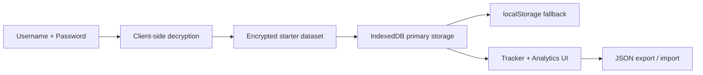

# Adil's Job Tracker V2

<p align="center">
  
  
  
  
  
  
</p>

<p align="center">
  A local-first job application dashboard with encrypted seed data, browser-side analytics, backup/export tooling, and a GitHub Pages deployment workflow.
</p>

## Snapshot



## Highlights

- Local-first tracker with resilient persistence and a serialized write queue.
- First-run seeding from your existing 61-record export.
- Client-side encrypted unlock flow for static hosting.
- Follow-up reminders, ghosting automation, analytics, import/export, and recovery logic.
- GitHub Pages workflow with automatic base-path handling.

<details>
<summary><strong>Feature Tour</strong></summary>

### Core workflow

- Add, edit, filter, sort, and delete applications.
- Track interview stages, follow-up dates, LinkedIn outreach, and notes.
- Auto-mark stale records as `Ghosted` after 21 days.
- Export the full dataset to JSON or merge/restore from backups.

### Analytics

- Daily application activity for the last 7 days.
- Status breakdown and month-by-month volume.
- Funnel view from application to offer.
- Response, interview, offer, and ghosting rates.

### Storage resilience

- IndexedDB is the primary store.
- localStorage is used as a fallback and backup target.
- Corrupt payloads are captured so you can recover or re-import data safely.

</details>

<details>
<summary><strong>Authentication Model</strong></summary>

The app now uses a stronger static-site pattern than a plain visible password check:

- Your starter dataset is stored in [`src/secureSeed.json`](src/secureSeed.json) as encrypted ciphertext.
- The login screen derives a key in the browser with PBKDF2 and decrypts the seed with AES-GCM.
- The decrypted records are then handed to the tracker, which persists future changes locally in the browser.

Important limitation:

- This is still a static frontend. It is better than shipping your job history in plaintext, but it is not equivalent to server-side authentication or access control.
- If you need real private access, move the app behind a backend, reverse proxy auth, or a private internal host.

Credential rotation lives in [`src/auth.js`](src/auth.js). To generate a new encryption key for a different username/password pair, rebuild [`src/secureSeed.json`](src/secureSeed.json) with your own secure export process.

</details>

<details>
<summary><strong>Local Development</strong></summary>

```bash
npm install
npm run dev
```

Production build:

```bash
npm run build
npm run preview
```

</details>

<details>
<summary><strong>GitHub Pages Deployment</strong></summary>

This repo includes [`deploy-pages.yml`](.github/workflows/deploy-pages.yml), which:

1. Installs dependencies with `npm ci`.
2. Detects the correct GitHub Pages base path automatically.
3. Builds the app with Vite.
4. Publishes the `dist/` artifact to Pages.

Recommended publish flow:

1. Create a GitHub repository.
2. Push this project to `main`.
3. In GitHub, open `Settings -> Pages` and confirm the source is GitHub Actions.
4. Let the workflow publish the site.

If the repo name is `username.github.io`, the app builds at `/`.
If it is a project repo like `job-tracker`, the app builds at `/job-tracker/`.

</details>

<details>
<summary><strong>Project Structure</strong></summary>

```text
.
├── .github/workflows/deploy-pages.yml
├── src/App.jsx
├── src/JobTracker.jsx
├── src/auth.js
├── src/secureSeed.json
├── src/styles.css
├── index.html
├── package.json
└── vite.config.js
```

</details>

## Notes

- Raw personal exports are excluded in [`.gitignore`](.gitignore) so you do not accidentally publish the plaintext backup files.
- The tracker is seeded on first successful unlock. After that, your browser copy becomes the working source of truth.
- If you want to change the look, start in [`src/styles.css`](src/styles.css) and the login shell in [`src/App.jsx`](src/App.jsx).
