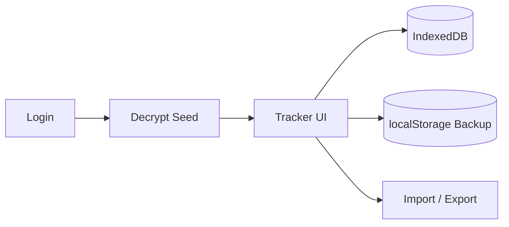

# Adil's Job Tracker V2

<p align="center">
  
  
  
  
  
</p>

Job search tracker designed for my workflow. It operates locally in the browser, supports encrypted initial data, and deploys seamlessly to GitHub Pages.

## Architecture



## What It Does

- Monitor applications, their statuses, interview stages, follow-ups, and notes.
- Provide quick analytics on progress, response rates, and outcomes.
- Automatically mark applications as "ghosted" after 21 days of inactivity.
- Allow importing and exporting of JSON backups.
- Initialise the app using an encrypted starter dataset upon first unlock.

## Run Locally

```bash
npm install
npm run dev
```

Build for production:

```bash
npm run build
```

## Deploy

The GitHub Actions workflow in [`.github/workflows/deploy-pages.yml`](.github/workflows/deploy-pages.yml) publishes the app to GitHub Pages from `main`.

## Notes

- Raw backup files are ignored by [`.gitignore`](.gitignore).
- The repo can stay private, but a GitHub Pages site is still public-facing.
- The login is a client-side gate for a static site, not full server-side authentication.
