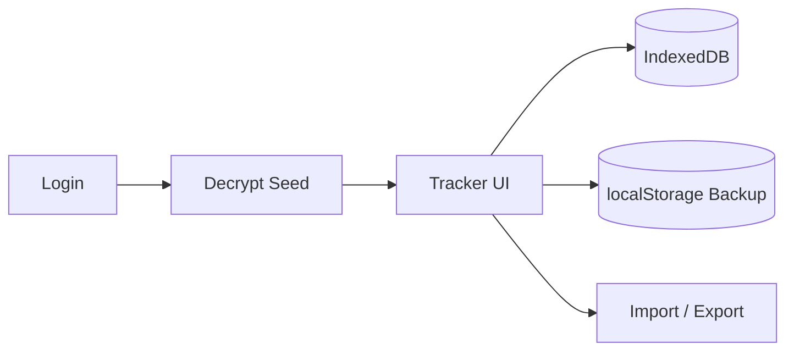

# Job Tracker Analytics

<p align="center">
  
  
  
  <a href="https://aosman101.github.io/job-search-analytics-tracker/"></a>
  
  
</p>

Job search tracker designed for my workflow. It operates locally in the browser, supports encrypted initial data, and deploys seamlessly to GitHub Pages.

Live website:
https://aosman101.github.io/job-search-analytics-tracker/

## Architecture


```mermaid
flowchart LR
  A[Login] --> B[Decrypt Seed]
  B --> C[Tracker UI]
  C --> D[(IndexedDB)]
  C --> E[(localStorage Backup)]
  C --> F[Import / Export]
```

## What It Does

- Monitor applications, their statuses, interview stages, follow-ups, and notes.
- Provide quick analytics on progress, response rates, and outcomes.
- Automatically mark applications as "ghosted" after 21 days of inactivity.
- Allow importing and exporting of JSON backups.
- Sync with Gmail: add applications from confirmation emails (LinkedIn, Indeed, Greenhouse, Lever, Workday, company sites), and mark them Rejected or Interview when those emails arrive.
- Initialise the app using an encrypted starter dataset upon first unlock.

## Run Locally

```bash
npm install
npm run dev
```

Build for production:

```bash
npm run build
```

## Gmail Sync

Click the mail icon in the header, or press `G`.

1. In [Google Cloud Console](https://console.cloud.google.com/), create a project and enable the **Gmail API**.
2. Under **Google Auth Platform → Audience**, leave the app in *Testing* and add your Gmail address as a test user.
3. Under **Clients**, create an OAuth client of type **Web application**. Add `http://localhost:5173` and `https://aosman101.github.io` as *Authorized JavaScript origins*.
4. Paste the client ID into the Gmail Sync dialog, or set it at build time as `VITE_GOOGLE_CLIENT_ID` (see `.env.example`).

How it works:

- Access is read-only (`gmail.readonly`). Emails are fetched and classified inside your browser, and nothing goes to any other server.
- The first sync looks back 30 days to 1 year (you choose). Later syncs only read new mail, and emails already processed are never applied twice.
- Rejection emails move the matching application to **Rejected**, interview invites move it to **Interview**, and confirmations for untracked roles are added as **Applied**. Matching uses the company name, with the role as a tie-breaker.
- Records added from email get a "from Gmail" flag. The details view links each email back to Gmail. Every sync can be undone from the toast.
- Google's browser tokens last one hour. While a token is valid, the tracker syncs when opened and every 15 minutes. After that, click **Sync now** (Google won't ask again once you've approved it). A static site cannot sync while the tab is closed.

## Deploy

The GitHub Actions workflow in [`.github/workflows/deploy-pages.yml`](.github/workflows/deploy-pages.yml) publishes the app to GitHub Pages from `main`.

## Notes

- Raw backup files are ignored by [`.gitignore`](.gitignore).
- The repo can stay private, but a GitHub Pages site is still public-facing.
- The login is a client-side gate for a static site, not full server-side authentication.
